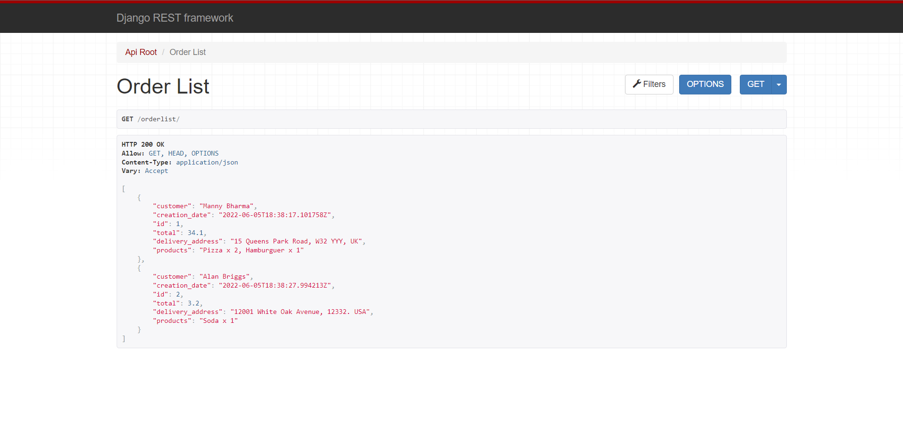
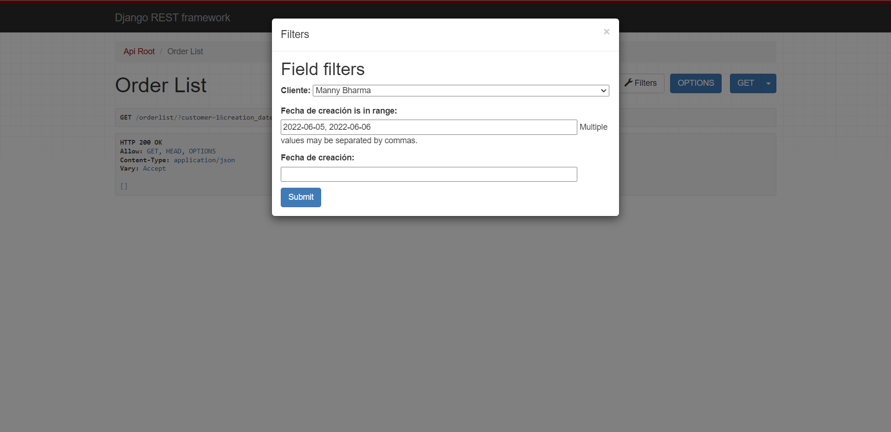
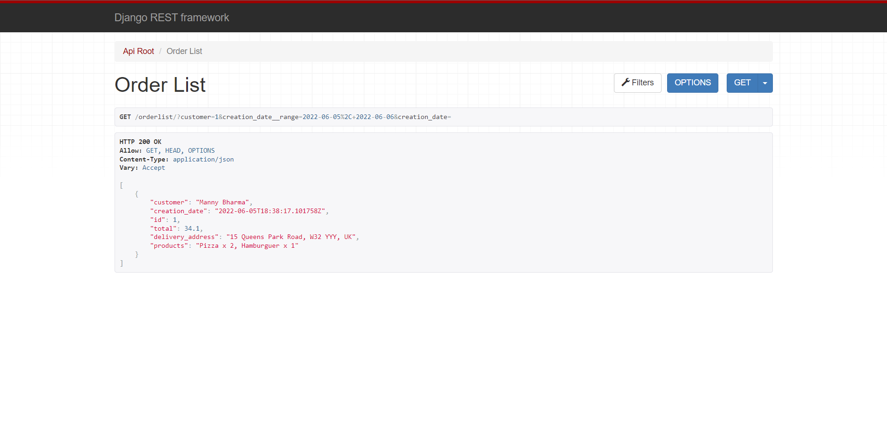
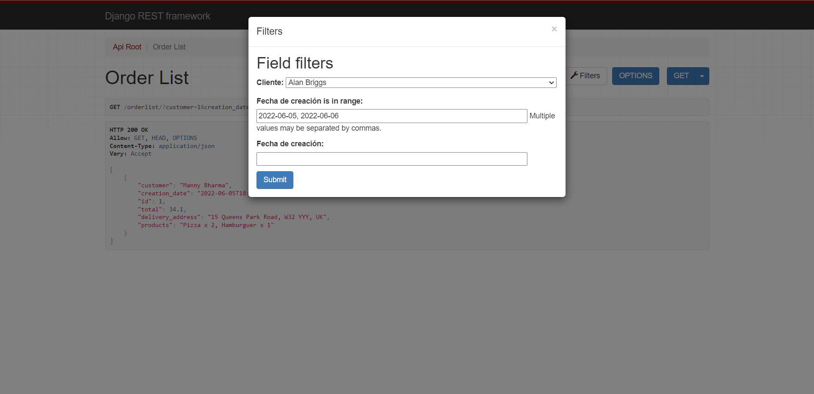
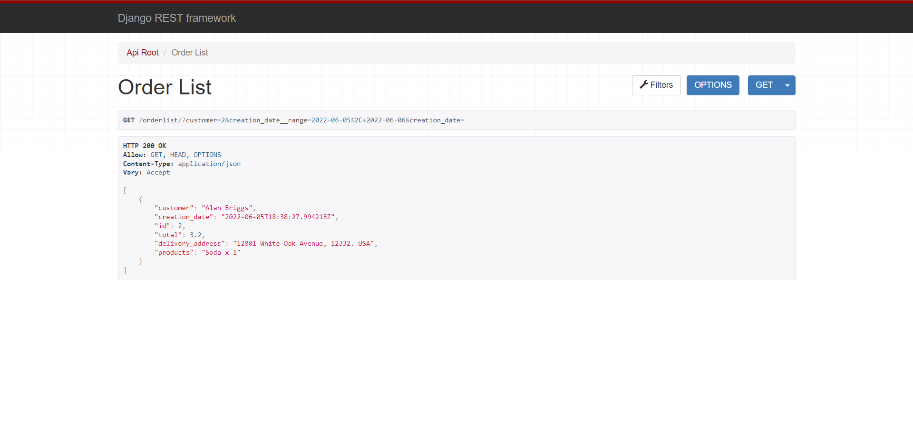

# Examen Práctico de Programación Backend Python
## Demo en Azure
https://beitechstore.azurewebsites.net/

## Documentación
https://beitechstore.azurewebsites.net/docs/

## Base de datos

  

## Requerimientos 
- Los datos de prueba para las tablas clientes, productos y productos permitidos se deben insertar directamente en la base de datos.
  - Clientes: http://beitechstore.azurewebsites.net/customer/
  - Productos: http://beitechstore.azurewebsites.net/product/
  - Productos disponibles: http://beitechstore.azurewebsites.net/customerproduct/
-	Los datos de prueba para las cualquier tabla adicional que haya creado también se pueden agregar directamente en la base de datos.
-	Las únicas tablas que no deben tener registros son ‘order’ y ‘order_detail’ en estas sólo se deben agregar registros a través del servicio web.
-	No es necesario implementar un CRUD para cada tabla en la base de datos, los endpoints indispensables para la prueba son: Creación de orden y Listar órdenes por rango de fechas.
    - Pedido: http://beitechstore.azurewebsites.net/order/
    - Detalle de pedido: http://beitechstore.azurewebsites.net/orderdetail/
      

      
      

    - Listar pedidos por rango de fecha: http://beitechstore.azurewebsites.net/orderlist/
      - Cliente: **Manny Bharma**
      

      
      
      

      
      - Cliente: **Alan Briggs**
      

      
      
      

      
## Entregables
-	El Diagrama Entidad Relación en formato imagen. [DER](https://github.com/davidbcaro/apistore/blob/main/DER-Database/ERD1.png)
-	La documentación de los métodos del API REST. [Documentación Swagger](https://beitechstore.azurewebsites.net/docs/) | https://beitechstore.azurewebsites.net/docs/
-	Diagrama de clases u otros diagramas que considere necesarios para ilustrar la solución. 
-	El código fuente de la aplicación. Este código preferiblemente debe estar en un repositorio git.

