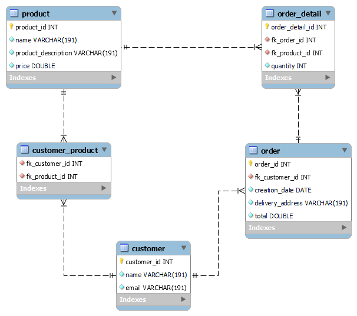

# Examen Práctico de Programación Backend Python
## Demo en Azure
https://beitechstore.azurewebsites.net/

## Base de datos

  

## Entregables
-	El Diagrama Entidad Relación en formato imagen. [DER](https://github.com/davidbcaro/apistore/blob/main/DER-Database/ERD1.png)
-	La documentación de los métodos del API REST. [Documentación Swagger](https://beitechstore.azurewebsites.net/docs/) | https://beitechstore.azurewebsites.net/docs/
-	Diagrama de clases u otros diagramas que considere necesarios para ilustrar la solución. 
-	El código fuente de la aplicación. Este código preferiblemente debe estar en un repositorio git.

